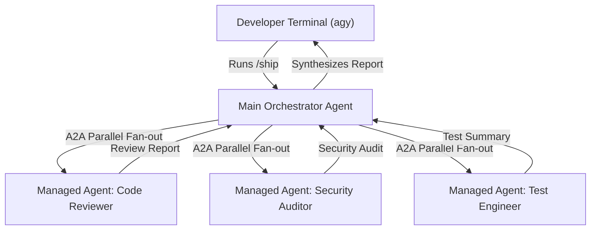

# Antigravity Platform & ADK Integration Guide

This guide details how the `agent-skills` framework natively maps to the capabilities of the **Antigravity Platform** and the **Agent Development Kit (ADK)** to establish a highly efficient, parallelized, and secure Software Development Lifecycle (SDLC).

---

## Architecture Mapping Overview

The three-tier orchestration model of `agent-skills` (Skills, Personas, Commands) aligns perfectly with the native features of the Antigravity ecosystem:

---

## 1. Personas as Managed Agents

Your specialized personas (`code-reviewer`, `security-auditor`, `test-engineer`) can be compiled and deployed as **Managed Agents** on the Gemini Enterprise Agent Platform.

*   **Secure Boundaries**: Hosting these agents on Google Cloud ensures they run in highly secure, sandboxed environments. They can safely execute deterministic Static Application Security Testing (SAST) scans, access enterprise repositories, or query internal knowledge bases without exposing raw intellectual property to the local terminal.
*   **Agent2Agent (A2A) Collaboration**: Using the platform's native A2A protocol, these remote specialized agents can collaborate dynamically, sharing context and passing structured payloads back and forth before returning consolidated findings to the terminal.

---

## 2. Skills and Commands via Antigravity CLI (`agy`)

The Antigravity CLI natively supports the concepts of Skills and Commands as first-class citizens in your local development environment.

*   **Custom Slash Commands**: Any `SKILL.md` file defined within your workspace (under `.gemini/skills/` or `skills/`) is automatically parsed and registered by the Antigravity CLI. This dynamically creates custom slash commands (e.g., `/review`, `/ship`, `/code-simplify`) directly in your terminal session, transforming your team's custom engineering playbooks into executable commands.
*   **Local Guardrails & Command Hooks**: You can enforce your local workflow policies (such as git branch patterns, commit rules, or credential scanning) using **Command Hooks** configured in the workspace or user configuration (`~/.gemini/config.json`). Before any code is committed, these hooks run local validation pipelines to prevent security/quality leaks before code leaves the local machine.

---

## 3. Fan-out Orchestration (`/ship`) via Subagents

The `/ship` command leverages the **Antigravity Harness** to execute complex, multi-agent evaluation workflows.

*   **Parallel Execution**: When `/ship` is triggered, the orchestrating terminal agent spawns multiple parallel **Subagents** (each pointing to its respective remote Managed Agent on Google Cloud).
*   **Context Isolation**: Each subagent analyzes the same git diff in its own isolated context window, preventing cross-contamination of thoughts and ensuring a thorough, independent assessment.
*   **Synthesis**: Once all review agents complete their tasks, the local terminal orchestrator aggregates the results, filters noise, highlights critical blockers, and renders a unified go/no-go decision.

---

## 4. Git-Based SDLC Integration (Shift-Left)

By combining local CLI execution with secure cloud-managed agents, you can shift quality and security checking completely to the left:

*   **Pre-commit & Pre-push Audits**: Rather than waiting for a heavy, slow, and expensive CI/CD pipeline to fail, developers can run automated multi-agent checks on their active branch. Security flaws, test-coverage gaps, and style issues are identified and fixed instantly in the local terminal.
*   **Unified Playbooks**: Since configuration is standardized inside `.gemini/` and `CLAUDE.md`, every developer on the team gets immediate access to the exact same `/ship` capability, ensuring consistent bar-raising reviews across the organization.
